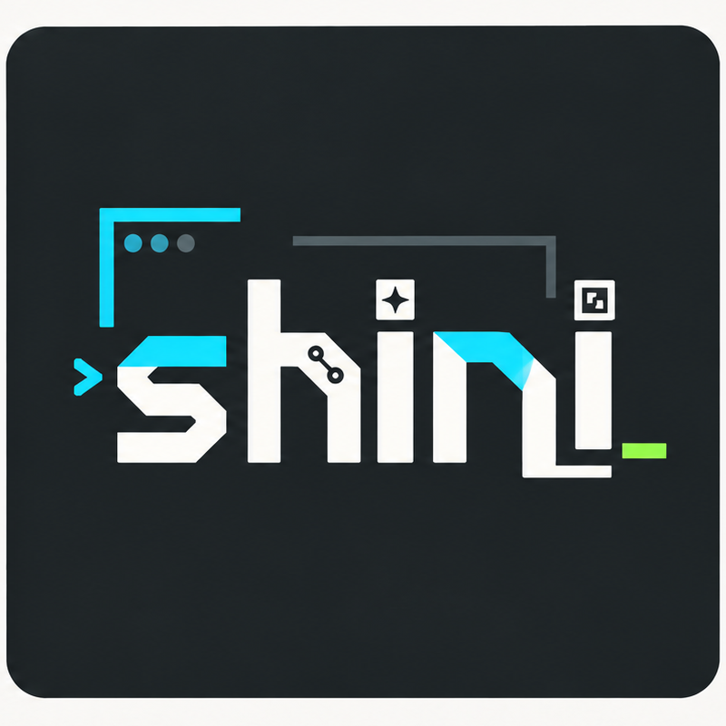

<h3>Full-Stack Developer · Technology Enthusiast · AI Explorer</h3>

 

  

---

## About Me

<table>
<tr>
<td width="58%" valign="top">

### Hi, I am **shini** (@ngshin)

I am a developer interested in building software systems that are practical, maintainable, and scalable. My current learning and development orientation focuses on **Full-Stack Development**, **Cloud & DevOps**, and **AI-oriented applications**.

- **Current Focus:** .NET Core, Python, React, Next.js, and backend development.
- **Learning Direction:** Cloud services, Docker, CI/CD, DevOps, and system design.
- **Technical Interests:** AI/ML, IoT systems, real-time dashboards, Web3, and blockchain.
- **Development Goal:** Build reliable applications with clean architecture, readable code, and long-term maintainability.

</td>
<td width="42%" align="center" valign="middle">

</td>
</tr>
</table>

---

## Connect with Me

---

## Technical Orientation

<table>
<tr>
<td align="center" width="33%">

<h3>Full-Stack Development</h3>

Designing frontend interfaces, backend APIs, databases, authentication, and deployment-ready systems.

</td>
<td align="center" width="33%">

<h3>AI/ML Applications</h3>

Exploring machine learning workflows, intelligent features, data processing, and AI-assisted software systems.

</td>
<td align="center" width="33%">

<h3>Cloud & DevOps</h3>

Learning containerization, CI/CD pipelines, cloud deployment, monitoring, and system reliability.

</td>
</tr>
</table>

---

## Tech Stack

### Programming Languages

### Frontend Development

### Backend Development

### Database, Cloud & DevOps

  

### Tools & Platforms

  

---

## Featured Directions

<table>
<tr>
<td width="50%" valign="top">

### Software Engineering

- Full-stack web application development.
- RESTful API design and backend services.
- Authentication and role-based access control.
- Database schema design and query optimization.
- Deployment on cloud-based platforms.

</td>
<td width="50%" valign="top">

### Research & Experimentation

- AI/ML integration into software systems.
- IoT data collection and dashboard visualization.
- Smart monitoring systems and real-time analytics.
- Software tools for academic and engineering workflows.
- Automation-oriented development practices.

</td>
</tr>
</table>

---

## GitHub Analytics

  

---

## Project Showcase

<table>
<tr>
<td width="50%" valign="top">

### Full-Stack Web Applications

Systems developed with frontend, backend, database, authentication, and deployment workflow.

**Main technologies:**  
React, Next.js, .NET Core, Node.js, MySQL, PostgreSQL.

</td>
<td width="50%" valign="top">

### AI/ML-Oriented Tools

Applications that integrate machine learning models, data processing pipelines, or intelligent automation.

**Main technologies:**  
Python, FastAPI, scikit-learn, TensorFlow/PyTorch, data visualization.

</td>
</tr>

<tr>
<td width="50%" valign="top">

### IoT & Realtime Monitoring

Systems for sensor data collection, device control, dashboards, and real-time monitoring.

**Main technologies:**  
ESP32, MQTT, REST API, Node.js, ThingsBoard, Supabase.

</td>
<td width="50%" valign="top">

### Academic & Engineering Tools

Utilities for report generation, document processing, visualization, and research-oriented workflows.

**Main technologies:**  
Python, LaTeX, Markdown, automation scripts, data processing.

</td>
</tr>
</table>

---

## Development Principles

<table>
<tr>
<td align="center" width="25%">
<h3>Clean Code</h3>

Readable structure, clear naming, and maintainable implementation.

</td>
<td align="center" width="25%">
<h3>Scalability</h3>

System design that can grow with users, data, and features.

</td>
<td align="center" width="25%">
<h3>Reliability</h3>

Stable behavior, controlled errors, and consistent user experience.

</td>
<td align="center" width="25%">
<h3>Continuous Learning</h3>

Improving technical depth through projects, research, and practice.

</td>
</tr>
</table>

---

