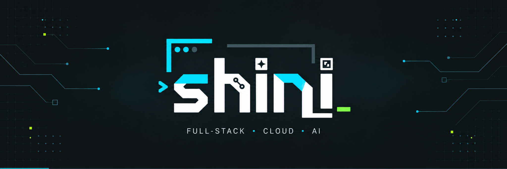
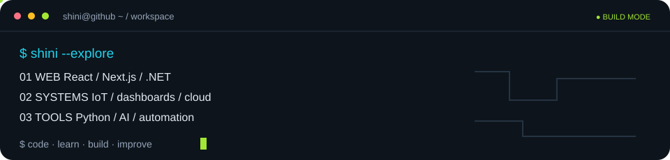
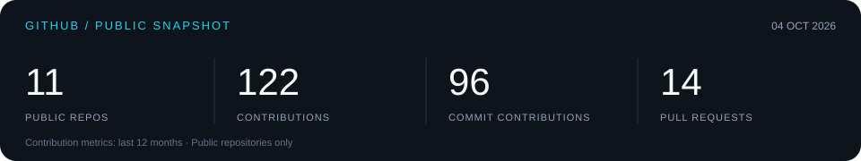
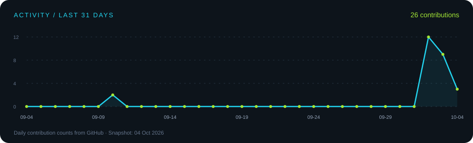
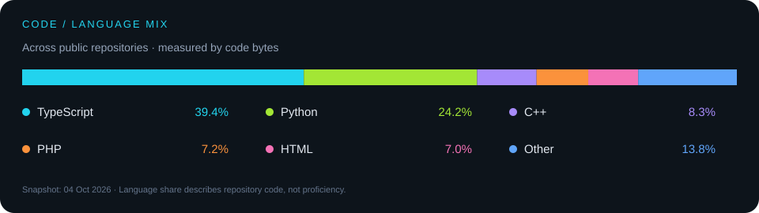

 

<a href="#build-log">BUILD LOG</a> &nbsp; / &nbsp; <a href="#github-dashboard">DASHBOARD</a> &nbsp; / &nbsp; <a href="#toolbox">TOOLBOX</a> &nbsp; / &nbsp; <a href="https://github.com/ngshini?tab=repositories">ALL REPOS ↗</a>

  

 

  

 

## A little about me

I'm **shini — Nguyen Ngoc Sinh**. I like connecting the pieces: a sensor to a dashboard, a model to an application, an idea to a working tool.

My projects cover **full-stack development**, **IoT**, **computer vision**, and **document automation**. I work with **TypeScript, Python, C++, and .NET**, while exploring cloud deployment, CI/CD, and maintainable system design.

> **Currently exploring:** connected systems, useful AI features, and tools that make engineering work easier.

## GitHub dashboard

<strong>More GitHub stats ↗</strong>

 

The local dashboard is a snapshot from **04 Oct 2026**. Contribution totals cover the preceding 12 months; the activity chart covers 31 days. Language percentages measure code bytes in public non-fork repositories. The badges and expandable stats card are served dynamically and may be cached.

## Build log

A few things I've been building. Open a repository for its setup, source, and current status.

| Project | What it does | Main stack |
| :--- | :--- | :--- |
| **[NB-IoT for BAS ↗](https://github.com/ngshini/NB-Iot-for-BAS)** | Reads a real wind-direction sensor with ESP32 and transmits data over NB-IoT or Wi-Fi using MQTT. | `C++` `ESP32` `MQTT` |
| **[BAS IoT Web Test ↗](https://github.com/ngshini/Web-test-Iot)** | A web interface for receiving and viewing MQTT sensor data. | `JavaScript` `HTML` `MQTT` |
| **[Smart Fire Monitoring ↗](https://github.com/ngshini/fire_detection_project)** | Detects fire and smoke with YOLOv8, displays results in a web app, and supports Telegram alerts. | `React` `TypeScript` `Python` |
| **[Kimes Flow ↗](https://github.com/ngshini/KimesFlow)** | A project and task management scaffold with Kanban interactions and dashboard charts. | `Next.js` `Supabase` `TypeScript` |
| **[Face Attendance ↗](https://github.com/ngshini/FaceAttend)** | A computer vision coursework project for face recognition and student attendance. | `Python` `OpenCV` `MySQL` |
| **[tool-latex ↗](https://github.com/ngshini/tool-latex)** | Converts Word documents to LaTeX through command-line and graphical interfaces. | `Python` `LaTeX` |

<a href="https://github.com/ngshini?tab=repositories"><strong>Explore all repositories →</strong></a>

## Toolbox

**Core / languages**

**Interfaces / web**

**Services / backend**

**Storage / infrastructure**

<strong>More tools & technologies</strong>

 

  

  

Also in my toolkit: **SQL Server · Cursor · Trello**.

## Next things to explore

- **Cloud & delivery:** Containerized apps, CI/CD pipelines, and deployment workflows.
- **AI & vision:** Model integration, useful alerts, and clearer data visualization.
- **Connected systems:** Reliable sensor ingestion and real-time monitoring.
- **Engineering tools:** Document processing, report generation, and practical automation.

 

**Code. Learn. Build. Improve.**

From a first prototype to the next useful commit.

  

<a href="https://github.com/ngshini">GitHub ↗</a> &nbsp; · &nbsp; <a href="https://github.com/ngshini?tab=repositories">Repositories ↗</a>

