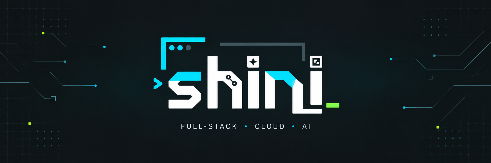

<h3>Full-Stack Developer · Technology Enthusiast · AI Explorer</h3>

 

<strong>Building practical software. Learning through every project.</strong>

---

## About Me

### Hi, I am **shini** (@ngshini)

I am a developer interested in building software systems that are practical, maintainable, and scalable. My current learning and development orientation focuses on **Full-Stack Development**, **Cloud & DevOps**, and **AI-oriented applications**.

- **Current Focus:** .NET Core, Python, React, Next.js, and backend development.
- **Learning Direction:** Cloud services, Docker, CI/CD, DevOps, and system design.
- **Technical Interests:** AI/ML, IoT systems, real-time dashboards, Web3, and blockchain.
- **Development Goal:** Build reliable applications with clean architecture, readable code, and long-term maintainability.

---

## Connect with Me

---

## Technical Orientation

- **Full-Stack Development:** Frontend interfaces, backend APIs, databases, authentication, and deployment.
- **AI/ML Applications:** Machine learning workflows, data processing, and intelligent software features.
- **Cloud & DevOps:** Containers, CI/CD pipelines, monitoring, and system reliability.

---

## Tech Stack

### Programming Languages

### Frontend Development

### Backend Development

### Database, Cloud & DevOps

  

### Tools & Platforms

  

---

## GitHub Analytics

  

---

## Development Principles

- **Clean Code:** Clear naming, readable structure, and maintainable implementation.
- **Scalability:** Systems that can grow with users, data, and features.
- **Reliability:** Stable behavior, controlled errors, and a consistent user experience.
- **Continuous Learning:** Improving through projects, research, and practice.

---

<strong>Code. Learn. Build. Improve.</strong>

<a href="https://github.com/ngshini?tab=repositories">Explore my repositories →</a>

